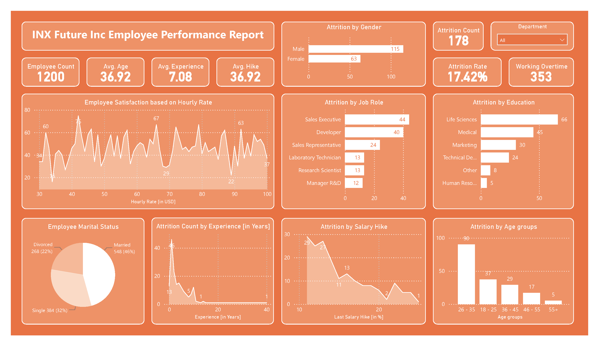

# 👥 Employee Performance & Attrition Dashboard (Power BI)

---

## 📌 Overview
This project is an **interactive HR analytics dashboard** built using **Power BI Desktop**.  
It focuses on **employee performance metrics** and **attrition trends**, providing actionable insights to HR and management teams for improving retention and workforce efficiency.

---

## 🛠 Tools Used
- **Power BI Desktop** – Data modeling, visualization, DAX calculations
- **Excel** – Data preprocessing
- **Power Query** - Data Preprocessing
- **DAX** – Custom measures & KPIs
- **Data Source** – Excel file dataset

---

## 📂 Dataset
**Source**: [INX_Future_Inc_Employee_Performance_Data](Dataset)  
**Format**: `.xlsx` (Excel)  
**Size**: ~1,200 rows  
**License**: Open dataset for educational purposes

---

## 📊 Key Insights
- **Attrition Rate**: Identifies high-risk departments with the greatest turnover
- **Performance Trends**: Highlights top-performing and underperforming teams
- **Demographic Patterns**: Attrition segmented by age, gender, and tenure
- **Retention Factors**: Links performance ratings with attrition rates

---

## 📸 Power BI Report (Dashboard) Preview

---
<!--
## 🚀 How to Use
1. Download the `.pbix` file from this repository.
2. Open the file in **Power BI Desktop** (latest version recommended).
3. Use the interactive filters to explore:
   - Region-specific performance
   - Product category sales
   - Monthly trends and profit margins

---
-->

## 📜 License
This project is licensed under the **MIT License** – see the [LICENSE](LICENSE) file for details.

